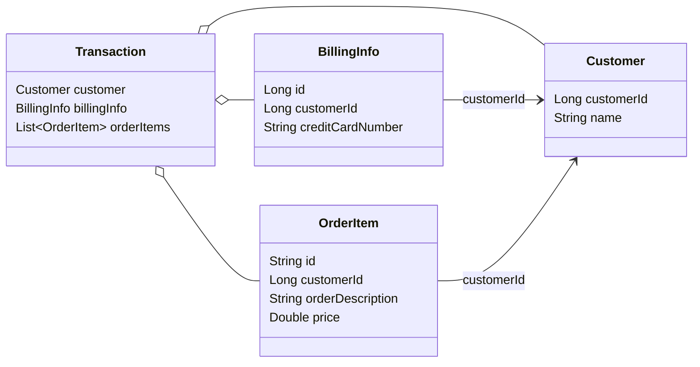
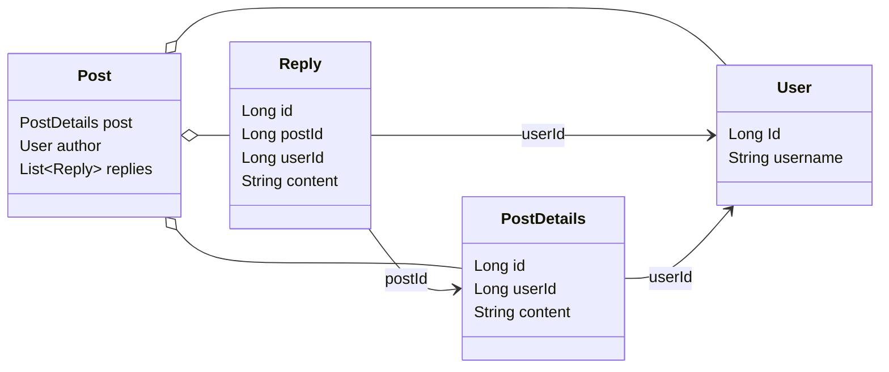
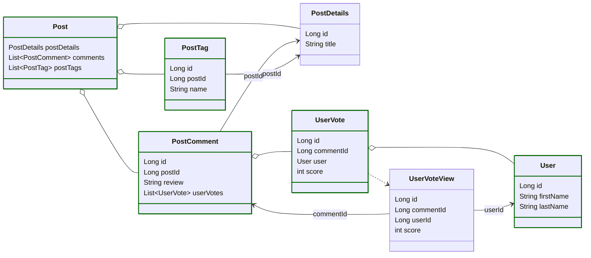

# Assembler
[](https://central.sonatype.com/artifact/io.github.pellse/assembler) [](http://javadoc.io/doc/io.github.pellse/assembler)
[](https://twitter.com/sebastien_pel)

***Assembler*** is a [reactive](https://www.reactivemanifesto.org), functional, type-safe, and stateless data aggregation framework for querying and merging data from multiple data sources/services. ***Assembler*** enables efficient implementation of the [API Composition Pattern](https://microservices.io/patterns/data/api-composition.html) and is also designed to solve the N + 1 query problem in a data polyglot environment. ***Assembler*** is architecture-agnostic, making it versatile for use in monolithic or microservice architectures, implementing REST or GraphQL endpoints, stream processing, and other scenarios.

Internally, ***Assembler*** leverages [Project Reactor](https://projectreactor.io) to implement end-to-end reactive stream pipelines and maintain all the reactive stream properties as defined by the [Reactive Manifesto](https://www.reactivemanifesto.org), including responsiveness, resilience, elasticity, message-driven with back-pressure, non-blocking, and more.

See the [demo app](https://github.com/pellse/assembler-spring-graphql-example) for a comprehensive project utilizing ***Assembler***.

*Here is an example from the [demo app GitHub repository ](https://github.com/pellse/assembler-spring-graphql-example) which integrates ***Assembler*** with Spring GraphQL to implement real-time data aggregation of multiple data sources:*

https://github.com/pellse/assembler-example/assets/23351878/388f8a65-bffd-4344-9e10-ca720ec2f5cd

## Table of Contents

- **[Use Cases](#use-cases)**
- **[Basic Usage](#basic-usage)**
  - [Default values for missing data](#default-values-for-missing-data)
- **[Infinite Stream of Data](#infinite-stream-of-data)**
- **[ID Join](#id-join)**
- **[Complex Relationship Graph And Cartesian Product](#complex-relationship-graph-and-cartesian-product)**
- **[Reactive Caching](#reactive-caching)**
  - [Third Party Reactive Cache Provider Integration](#third-party-reactive-cache-provider-integration)
  - [Auto Caching](#auto-caching)
    - *[Event Based Auto Caching](#event-based-auto-caching)*
- **[Integration with non-reactive sources](#integration-with-non-reactive-sources)**
- **[What's Next?](#whats-next)**

## Use Cases

***Assembler*** can be used in situations where an application needs to access data or functionality that is spread across multiple services. Some common use cases include:

1. **CQRS/Event Sourcing**: ***Assembler*** can be used on the read side of a CQRS and Event Sourcing architecture to efficiently build materialized views that aggregate data from multiple sources.
2. **API Gateway**: ***Assembler*** can be used in conjunction with an API Gateway, which acts as a single entry point for all client requests. The API Gateway can combine multiple APIs into a single, unified API, simplifying the client's interactions with the APIs and providing a unified interface for the client to use.
3. **Backends for Frontends**: ***Assembler*** can also be used in conjunction with Backends for Frontends (BFFs). A BFF is a dedicated backend service that provides a simplified and optimized API specifically tailored for a particular client or group of clients.
4. **Reduce network overhead**: By combining multiple APIs into a single API, ***Assembler*** can reduce the amount of network traffic required for a client to complete a task. This can improve the performance of the client application and reduce the load on the server.
5. **Solve the N + 1 Query Problem**:  ***Assembler*** can solve the N + 1 query problem by allowing a client to make a single request to a unified API that includes all the necessary data. This approach reduces the number of requests required and database queries, further optimizing the application's performance.

[:arrow_up:](#table-of-contents)

## Basic Usage
Here is an example of how to use ***Assembler*** to generate transaction information from a list of customers of an online store. This example assumes the following fictional data model and API to access different services:
```java
public record Customer(Long customerId, String name) {}
public record BillingInfo(Long id, Long customerId, String creditCardNumber) {}
public record OrderItem(String id, Long customerId, String orderDescription, Double price) {}
public record Transaction(Customer customer, BillingInfo billingInfo, List<OrderItem> orderItems) {}
```

```java
Flux<Customer> getCustomers(); // e.g. call to a microservice or a Flux connected to a Kafka source
Flux<BillingInfo> getBillingInfo(List<Long> customerIds); // e.g. connects to relational database (R2DBC)
Flux<OrderItem> getAllOrders(List<Long> customerIds); // e.g. connects to MongoDB
```
In cases where the `getCustomers()` method returns a substantial number of customers, retrieving the associated `BillingInfo` for each customer would require an additional call per `customerId`. This would result in a considerable increase in network calls, causing the N + 1 queries issue. To mitigate this, we can retrieve all the `BillingInfo` for all the customers returned by `getCustomers()` with a single additional call. The same approach can be used for retrieving OrderItem information.

As we are working with three distinct and independent data sources, the process of joining data from `Customer`, `BillingInfo`, and `OrderItem` into a `Transaction` must be performed at the application level. This is the primary objective of ***Assembler***.

When utilizing the [Assembler](https://central.sonatype.com/artifact/io.github.pellse/assembler), the aggregation of multiple reactive data sources and the implementation of the [API Composition Pattern](https://microservices.io/patterns/data/api-composition.html) can be accomplished as follows:

```java
import reactor.core.publisher.Flux;
import io.github.pellse.assembler.Assembler;

import static io.github.pellse.assembler.AssemblerBuilder.assemblerOf;
import static io.github.pellse.assembler.RuleMapper.oneToMany;
import static io.github.pellse.assembler.RuleMapper.oneToOne;
import static io.github.pellse.assembler.RuleMapperSource.call;
import static io.github.pellse.assembler.Rule.rule;

Assembler<Customer, Transaction> assembler = assemblerOf(Transaction.class)
  .withCorrelationIdResolver(Customer::customerId)
  .withRules(
    rule(BillingInfo::customerId, oneToOne(call(this::getBillingInfo))),
    rule(OrderItem::customerId, oneToMany(OrderItem::id, call(this::getAllOrders))),
    Transaction::new)
  .build();

Flux<Transaction> transactionFlux = assembler.assemble(getCustomers());
```
The code snippet above demonstrates the process of first retrieving all customers, followed by the concurrent retrieval of all billing information and orders (in a single query) associated with the previously retrieved customers, as defined by the ***Assembler*** rules. The final step involves aggregating each customer, their respective billing information, and list of order items (related by the same customer id) into a `Transaction` object. This results in a reactive stream (`Flux`) of `Transaction` objects.

[:arrow_up:](#table-of-contents)

### Default values for missing data
To provide a default value for each missing values from the result of the API call, a factory function can also be supplied as a 2nd parameter to the `oneToOne()` function. For example, when `getCustomers()` returns 3 `Customer` *[C1, C2, C3]*, and `getBillingInfo([ID1, ID2, ID3])` returns only 2 associated `BillingInfo` *[B1, B2]*, the missing value *B3* can be generated as a default value. By doing so, a `null` `BillingInfo` is never passed to the `Transaction` constructor:
```java
rule(BillingInfo::customerId, oneToOne(call(this::getBillingInfo), customerId -> createDefaultBillingInfo(customerId)))
``` 
or more concisely:
```java
rule(BillingInfo::customerId, oneToOne(call(this::getBillingInfo), this::createDefaultBillingInfo))
```
Unlike the `oneToOne()` function, `oneToMany()` will always default to generating an empty collection. Therefore, providing a default factory function is not needed. In the example above, an empty `List<OrderItem>` is passed to the `Transaction` constructor if `getAllOrders([1, 2, 3])` returns `null`.

[:arrow_up:](#table-of-contents)

## Infinite Stream of Data
In situations where an infinite or very large stream of data is being handled, such as dealing with 100,000+ customers, ***Assembler*** needs to completely drain the upstream from `getCustomers()` to gather all correlation IDs (customerId). This can lead to resource exhaustion if not handled correctly. To mitigate this issue, the stream can be split into multiple smaller streams and processed in batches. Most reactive libraries already support this concept. Below is an example of this approach, utilizing [Project Reactor](https://projectreactor.io):
```java
Flux<Transaction> transactionFlux = getCustomers()
  .windowTimeout(100, ofSeconds(5))
  .flatMapSequential(assembler::assemble);
```
[:arrow_up:](#table-of-contents)

## ID Join
***Assembler*** supports the concept of ID joins, semantically similar to SQL joins, to solve the issue of missing correlation IDs between primary and dependent entities. For example, assuming the following data model:
```java
public record PostDetails(Long id, Long userId, String content) {}
public record User(Long Id, String username) {} // No postId field i.e. no correlation Id back to PostDetails
public record Reply(Long id, Long postId, Long userId, String content) {}
public record Post(PostDetails post, User author, List<Reply> replies) {}
```

Without ID Join, there is no way to express the relationship between e.g. a `PostDetails` and a `User` because `User` doesn't have a `postId` field like `Reply` does:
```java
Assembler<PostDetails, Post> assembler = assemblerOf(Post.class)
  .withCorrelationIdResolver(PostDetails::id)
  .withRules(
    rule(XXXXX, oneToOne(call(PostDetails::userId, this::getUsersById))), // What should XXXXX be?
    rule(Reply::postId, oneToMany(Reply::id, call(this::getRepliesById))),
    Post::new)
  .build();
```
With ID Join, this relationship can now be expressed:
```java
Assembler<PostDetails, Post> assembler = assemblerOf(Post.class)
  .withCorrelationIdResolver(PostDetails::id)
  .withRules(
    rule(User::Id, PostDetails::userId, oneToOne(call(this::getUsersById))), // ID Join
    rule(Reply::postId, oneToMany(Reply::id, call(this::getRepliesById))),
    Post::new)
  .build();
```
This would be semantically equivalent to the following SQL query if all entities were stored in the same relational database:
```sql
SELECT 
    p.id AS post_id,
    p.userId AS post_userId,
    p.content AS post_content,
    u.id AS author_id,
    u.username AS author_username,
    r.id AS reply_id,
    r.postId AS reply_postId,
    r.userId AS reply_userId,
    r.content AS reply_content
FROM 
    PostDetails p
JOIN 
    User u ON p.userId = u.id -- rule(User::Id, PostDetails::userId, ...)
LEFT JOIN 
    Reply r ON p.id = r.postId -- rule(Reply::postId, ...)
WHERE 
    p.id IN (1, 2, 3); -- withCorrelationIdResolver(PostDetails::id)
```
[:arrow_up:](#table-of-contents)

## Complex Relationship Graph And Cartesian Product
The _Cartesian Product_ problem occurs when multiple data sources (e.g. tables in relational databases) are joined in such a way that every row from one table is paired with every row from another, leading to an excessive and inefficient number of rows. This can happen unintentionally, especially with complex joins, causing performance bottlenecks.

This great [article](https://vladmihalcea.com/blaze-persistence-multiset) from [Vlad Mihalcea](https://vladmihalcea.com/), which was the inspiration for the implementation of this feature available since [v0.7.6](https://github.com/pellse/assembler/releases/tag/v0.7.6), explains _how we can fetch multiple JPA entity collections without generating an implicit Cartesian Product_, in the context of relational databases. But what happens when trying to query, to quote the article, a "_multi-level hierarchical structure_" over multiple types of data sources distributed across multiple servers?

The ***Assembler*** addresses this problem by aggregating sub-queries through the connection of embedded ***Assembler*** instances, enabling the modeling of complex relationship graphs across disparate data sources (e.g., microservices, relational or non-relational databases, message queues, etc.) without triggering N+1 queries or _Cartesian Products_, while maintaining structured concurrency and preserving the system's non-blocking, reactive properties.

For example, assuming the following data model:
```java
import org.jspecify.annotations.NonNull;
import org.jspecify.annotations.Nullable;

record Post(PostDetails postDetails, List<PostComment> comments, List<PostTag> postTags) {}

record PostDetails(Long id, String title) {}

record PostComment(Long id, Long postId, String review, @Nullable List<UserVote> userVotes) {
  PostComment(PostComment postComment, @NonNull List<UserVote> userVotes) {
    this(postComment.id(), postComment.postId(), postComment.review(), userVotes);
  }
}

record UserVoteView(Long id, Long commentId, Long userId, int score) {}

record UserVote(Long id, Long commentId, User user, int score) {
  UserVote(UserVoteView userVoteView, User user) {
    this(userVoteView.id(), userVoteView.commentId(), user, userVoteView.score());
  }
}

record User(Long id, String firstName, String lastName) {}

record PostTag(Long id, Long postId, String name) {}
```

Here is how we would connect ***Assembler*** instances together to build our entity graph:
```java
import io.github.pellse.assembler.Assembler;
import reactor.core.publisher.Flux;

import static io.github.pellse.assembler.Assembler.assemble;
import static io.github.pellse.assembler.AssemblerBuilder.assemblerOf;
import static io.github.pellse.assembler.Rule.rule;
import static io.github.pellse.assembler.RuleMapper.oneToMany;
import static io.github.pellse.assembler.RuleMapper.oneToOne;
import static io.github.pellse.assembler.RuleMapperSource.call;
import static java.time.Duration.ofSeconds;

Assembler<UserVoteView, UserVote> userVoteAssembler = assemblerOf(UserVote.class)
  .withCorrelationIdResolver(UserVoteView::id)
  .withRules(
    rule(User::id, UserVoteView::userId, oneToOne(call(this::getUsersById))),
    UserVote::new)
  .build();

Assembler<PostComment, PostComment> postCommentAssembler = assemblerOf(PostComment.class)
  .withCorrelationIdResolver(PostComment::id)
  .withRules(
    rule(UserVote::commentId, oneToMany(UserVote::id, call(assemble(this::getUserVoteViewsById, userVoteAssembler)))),
    PostComment::new)
  .build();

Assembler<PostDetails, Post> postAssembler = assemblerOf(Post.class)
  .withCorrelationIdResolver(PostDetails::id)
  .withRules(
    rule(PostComment::postId, oneToMany(PostComment::id, call(assemble(this::getPostCommentsById, postCommentAssembler)))),
    rule(PostTag::postId, oneToMany(PostTag::id, call(this::getPostTagsById))),
    Post::new)
  .build();

// If getPostDetails() is a finite sequence
Flux<Post> postFlux = postAssembler.assemble(getPostDetails());

// If getPostDetails() is a continuous stream
Flux<Post> postFlux = getPostDetails()
  .windowTimeout(100, ofSeconds(5))
  .flatMapSequential(postAssembler::assemble);
```
See [EmbeddedAssemblerTest.java](assembler/src/test/java/io/github/pellse/assembler/test/EmbeddedAssemblerTest.java) for the complete example of how to use this feature.

[:arrow_up:](#table-of-contents)

## Reactive Caching
Apart from offering convenient helper functions to define mapping semantics such as `oneToOne()` and `oneToMany()`, ***Assembler*** also includes a caching/memoization mechanism for the downstream subqueries via the `cached()` and `cachedMany()` wrapper functions:

```java
import io.github.pellse.assembler.Assembler;

import static io.github.pellse.assembler.AssemblerBuilder.assemblerOf;
import static io.github.pellse.assembler.RuleMapper.oneToMany;
import static io.github.pellse.assembler.RuleMapper.oneToOne;
import static io.github.pellse.assembler.RuleMapperSource.call;
import static io.github.pellse.assembler.Rule.rule;
import static io.github.pellse.assembler.caching.CacheFactory.cached;
import static io.github.pellse.assembler.caching.CacheFactory.cachedMany;

var assembler = assemblerOf(Transaction.class)
  .withCorrelationIdResolver(Customer::customerId)
  .withRules(
    rule(BillingInfo::customerId, oneToOne(cached(call(this::getBillingInfo)))),
    rule(OrderItem::customerId, oneToMany(OrderItem::id, cachedMany(call(this::getAllOrders)))),
    Transaction::new)
  .build();

var transactionFlux = getCustomers()
  .window(3)
  .flatMapSequential(assembler::assemble);
```
[:arrow_up:](#table-of-contents)

### Third Party Reactive Cache Provider Integration

The `cached()` and `cachedMany()` functions include overloaded versions that enable users to utilize different `Cache` implementations. By providing an additional parameter of type `CacheFactory` to the `cached()` method, users can customize the caching mechanism as per their requirements. In case no `CacheFactory` parameter is passed to `cached()`, the default implementation will internally use a `Cache` based on `ConcurrentHashMap`.

***All `Cache` implementations are internally decorated with non-blocking concurrency controls, making them safe for concurrent access and modifications.***

Below is a compilation of supplementary modules that are available for integration with third-party caching libraries. Additional modules will be incorporated in the future:

| Assembler add-on module                                                                                                                                                                                                      | Third party cache library                               |
|------------------------------------------------------------------------------------------------------------------------------------------------------------------------------------------------------------------------------|---------------------------------------------------------|
| [](https://central.sonatype.com/artifact/io.github.pellse/assembler-cache-caffeine)     | [Caffeine](https://github.com/ben-manes/caffeine)       |
| [](https://central.sonatype.com/artifact/io.github.pellse/assembler-spring-cache) | [Spring Caching](https://docs.spring.io/spring-boot/reference/io/caching.html) |

Here is a sample implementation of `CacheFactory` that showcases the use of the [Caffeine](https://github.com/ben-manes/caffeine) library, which can be accomplished via the `caffeineCache()` helper method. This helper method is provided as part of the caffeine add-on module:

```java
import com.github.benmanes.caffeine.cache.Caffeine;

import static com.github.benmanes.caffeine.cache.Caffeine.newBuilder;

import static io.github.pellse.assembler.AssemblerBuilder.assemblerOf;
import static io.github.pellse.assembler.RuleMapper.oneToMany;
import static io.github.pellse.assembler.RuleMapper.oneToOne;
import static io.github.pellse.assembler.RuleMapperSource.call;
import static io.github.pellse.assembler.Rule.rule;
import static io.github.pellse.assembler.caching.CacheFactory.cached;
import static io.github.pellse.assembler.caching.CacheFactory.cachedMany;
import static io.github.pellse.assembler.caching.caffeine.CaffeineCacheFactory.caffeineCache;

Caffeine<Object, Object> cacheBuilder = newBuilder()
  .recordStats()
  .expireAfterWrite(ofMinutes(10))
  .maximumSize(1000);

var assembler = assemblerOf(Transaction.class)
  .withCorrelationIdResolver(Customer::customerId)
  .withRules(
    rule(BillingInfo::customerId, oneToOne(cached(call(this::getBillingInfo), caffeineCache(cacheBuilder)))),
    rule(OrderItem::customerId, oneToMany(OrderItem::id, cachedMany(call(this::getAllOrders), caffeineCache()))),
    Transaction::new)
  .build();
```
[:arrow_up:](#table-of-contents)

### Auto Caching
In addition to the cache mechanism provided by the `cached()` and `cachedMany()` functions, ***Assembler*** also provides a mechanism to automatically and asynchronously update the cache in real-time as new data becomes available via the `autoCache()` function. This ensures that the cache is always up-to-date and avoids in most cases the need for `cached()` to fall back to fetch missing data.

The auto caching mechanism in ***Assembler*** can be seen as being conceptually similar to a `KTable` in Kafka. Both mechanisms provide a way to keep a key-value store updated in real-time with the latest value per key from its associated data stream. However, ***Assembler*** is not limited to just Kafka data sources and can work with any data source that can be consumed in a reactive stream.

This is how `autoCache()` connects to a data stream and automatically and asynchronously update the cache in real-time:

```java
import reactor.core.publisher.Flux;
import io.github.pellse.assembler.Assembler;

import static io.github.pellse.assembler.AssemblerBuilder.assemblerOf;
import static io.github.pellse.assembler.RuleMapper.oneToMany;
import static io.github.pellse.assembler.RuleMapper.oneToOne;
import static io.github.pellse.assembler.RuleMapperSource.call;
import static io.github.pellse.assembler.Rule.rule;
import static io.github.pellse.assembler.caching.CacheFactory.cached;
import static io.github.pellse.assembler.caching.CacheFactory.cachedMany;
import static io.github.pellse.assembler.caching.AutoCacheFactory;

Flux<BillingInfo> billingInfoFlux = ... // From e.g. Debezium/Kafka, RabbitMQ, etc.;
Flux<OrderItem> orderItemFlux = ... // From e.g. Debezium/Kafka, RabbitMQ, etc.;

var assembler = assemblerOf(Transaction.class)
  .withCorrelationIdResolver(Customer::customerId)
  .withRules(
    rule(BillingInfo::customerId,
      oneToOne(cached(call(this::getBillingInfo), caffeineCache(), autoCache(billingInfoFlux)))),
    rule(OrderItem::customerId,
      oneToMany(OrderItem::id, cachedMany(call(this::getAllOrders), autoCache(orderItemFlux)))),
    Transaction::new)
  .build();

var transactionFlux = getCustomers()
  .window(3)
  .flatMapSequential(assembler::assemble);
```

It is also possible to customize the Auto Caching configuration via `autoCacheBuilder()`:

```java
import reactor.core.publisher.Flux;
import io.github.pellse.assembler.Assembler;

import static io.github.pellse.assembler.AssemblerBuilder.assemblerOf;
import static io.github.pellse.assembler.RuleMapper.oneToMany;
import static io.github.pellse.assembler.RuleMapper.oneToOne;
import static io.github.pellse.assembler.RuleMapperSource.call;
import static io.github.pellse.assembler.Rule.rule;
import static io.github.pellse.assembler.caching.CacheFactory.cached;
import static io.github.pellse.assembler.caching.CacheFactory.cachedMany;
import static io.github.pellse.assembler.caching.AutoCacheFactoryBuilder.autoCacheBuilder;
import static io.github.pellse.assembler.caching.AutoCacheFactory.OnErrorMap.onErrorMap;
import static reactor.core.scheduler.Schedulers.newParallel;
import static java.lang.System.getLogger;

var logger = getLogger("auto-cache-logger");

Flux<BillingInfo> billingInfoFlux = ... // From e.g. Debezium/Kafka, RabbitMQ, etc.;
Flux<OrderItem> orderItemFlux = ... // From e.g. Debezium/Kafka, RabbitMQ, etc.;

var assembler = assemblerOf(Transaction.class)
  .withCorrelationIdResolver(Customer::customerId)
  .withRules(
    rule(BillingInfo::customerId, oneToOne(cached(call(this::getBillingInfo),
      autoCacheBuilder(billingInfoFlux)
        .maxWindowSizeAndTime(100, ofSeconds(5))
        .errorHandler(error -> logger.log(WARNING, "Error in autoCache", error))
        .scheduler(newParallel("billing-info"))
        .build()))),
    rule(OrderItem::customerId, oneToMany(OrderItem::id, cachedMany(call(this::getAllOrders),
      autoCacheBuilder(orderItemFlux)
        .maxWindowSize(50)
        .errorHandler(onErrorMap(MyException::new))
        .scheduler(newParallel("order-item"))
        .build()))),
    Transaction::new)
  .build();

var transactionFlux = getCustomers()
  .window(3)
  .flatMapSequential(assembler::assemble);
```
By default, the cache is updated for every element from the incoming stream of data, but it can be configured to batch the cache updates, useful when we are updating a remote cache to optimize network calls

[:arrow_up:](#table-of-contents)

### Event Based Auto Caching
Assuming the following custom domain events not known by ***Assembler***:
```java
sealed interface MyEvent<T> {
  T item();
}

record ItemUpdated<T>(T item) implements MyEvent<T> {}
record ItemDeleted<T>(T item) implements MyEvent<T> {}

record MyOtherEvent<T>(T value, boolean isAddOrUpdateEvent) {}

// E.g. Flux coming from a Change Data Capture/Kafka source
Flux<MyOtherEvent<BillingInfo>> billingInfoFlux = Flux.just(
  new MyOtherEvent<>(billingInfo1, true), new MyOtherEvent<>(billingInfo2, true),
  new MyOtherEvent<>(billingInfo2, false), new MyOtherEvent<>(billingInfo3, false));

// E.g. Flux coming from a Change Data Capture/Kafka source
Flux<MyEvent<OrderItem>> orderItemFlux = Flux.just(
  new ItemUpdated<>(orderItem11), new ItemUpdated<>(orderItem12), new ItemUpdated<>(orderItem13),
  new ItemDeleted<>(orderItem31), new ItemDeleted<>(orderItem32), new ItemDeleted<>(orderItem33));
```
Here is how `autoCache()` can be used to adapt those custom domain events to add, update or delete entries from the cache in real-time:

```java
import io.github.pellse.assembler.Assembler;

import static io.github.pellse.assembler.AssemblerBuilder.assemblerOf;
import static io.github.pellse.assembler.RuleMapper.oneToMany;
import static io.github.pellse.assembler.RuleMapper.oneToOne;
import static io.github.pellse.assembler.RuleMapperSource.call;
import static io.github.pellse.assembler.Rule.rule;
import static io.github.pellse.assembler.caching.CacheFactory.cached;
import static io.github.pellse.assembler.caching.CacheFactory.cachedMany;
import static io.github.pellse.assembler.caching.AutoCacheFactory.autoCache;

Assembler<Customer, Transaction> assembler = assemblerOf(Transaction.class)
  .withCorrelationIdResolver(Customer::customerId)
  .withRules(
    rule(BillingInfo::customerId, oneToOne(cached(call(this::getBillingInfo),
      autoCache(billingInfoFlux, MyOtherEvent::isAddOrUpdateEvent, MyOtherEvent::value)))),
    rule(OrderItem::customerId, oneToMany(OrderItem::id, cachedMany(call(this::getAllOrders),
      autoCache(orderItemFlux, ItemUpdated.class::isInstance, MyEvent::item)))),
    Transaction::new)
  .build();

var transactionFlux = getCustomers()
  .window(3)
  .flatMapSequential(assembler::assemble);
```
[:arrow_up:](#table-of-contents)

## Integration with non-reactive sources
A utility function `toPublisher()` is also provided to wrap non-reactive sources, useful when e.g. calling 3rd party synchronous APIs:

```java
import reactor.core.publisher.Flux;
import io.github.pellse.assembler.Assembler;

import static io.github.pellse.assembler.AssemblerBuilder.assemblerOf;
import static io.github.pellse.assembler.RuleMapper.oneToMany;
import static io.github.pellse.assembler.RuleMapper.oneToOne;
import static io.github.pellse.assembler.RuleMapperSource.call;
import static io.github.pellse.assembler.Rule.rule;
import static io.github.pellse.assembler.QueryUtils.toPublisher;

List<BillingInfo> getBillingInfo(List<Long> customerIds); // non-reactive source

List<OrderItem> getAllOrders(List<Long> customerIds); // non-reactive source

Assembler<Customer, Transaction> assembler = assemblerOf(Transaction.class)
  .withCorrelationIdResolver(Customer::customerId)
  .withRules(
    rule(BillingInfo::customerId, oneToOne(call(toPublisher(this::getBillingInfo)))),
    rule(OrderItem::customerId, oneToMany(OrderItem::id, call(toPublisher(this::getAllOrders)))),
    Transaction::new)
  .build();
```
[:arrow_up:](#table-of-contents)

## What's Next?
See the [list of issues](https://github.com/pellse/assembler/issues) for planned improvements in a near future.

[:arrow_up:](#table-of-contents)
